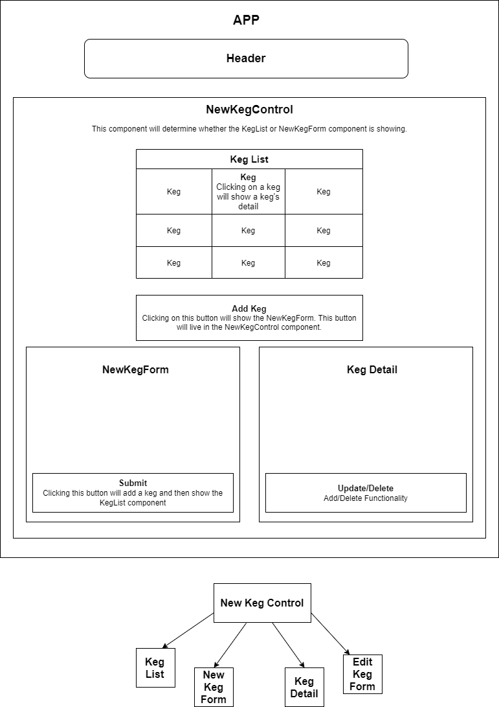

# KARI Kombucha Taproom with Redux

By Ophelia Swen 11/20/2020

## Description
Part two of Epicodus react/redux exercise. This web application is designed to enable user to track their kegs and show a list of available kegs for sale. This project was bootstrapped with [Create React App](https://github.com/facebook/create-react-app). 

## Setup/Installation Requirements

- Clone or download project files from https://github.com/oswen138/tap-room.git  
- Run \$npm install from root directory to install essential packages   
- Run \$npm start to open project on local server
- Run project on localhost:3000 on your browser of choice

In the project directory, you can also run:

### `yarn start`

Runs the app in the development mode.\
Open [http://localhost:3000](http://localhost:3000) to view it in the browser.

The page will reload if you make edits.\
You will also see any lint errors in the console.

## Component Diagram

## Known Bugs
* No known bugs at this time.

## Technologies Used
* Javascript
  * React
  * Webpack
* HTML
* CSS

### License

Copyright (c) 2020 Ophelia Swen